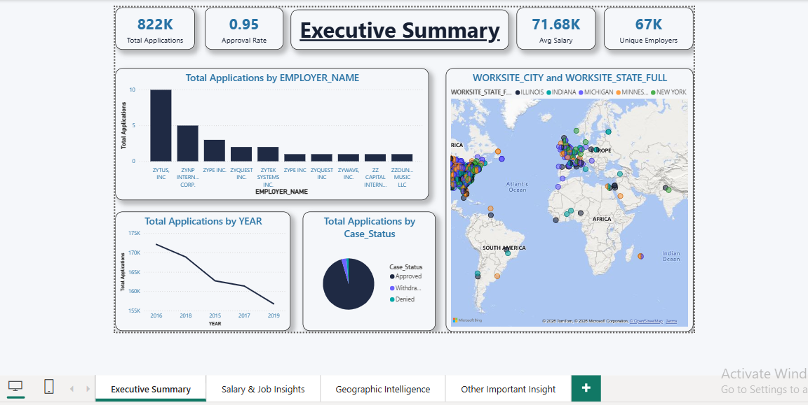

# 📊 H1B Visa Data Analysis Dashboard

## 🎯 Project Overview
This project analyzes H1B visa application data from **2015–2019** to uncover insights related to employer hiring patterns, approval rates, salary distribution, and geographic demand.  
The dashboard was developed using **Python for data cleaning** and **Power BI for visualization**.

---

## 🛠 Tools & Technologies
- Python (Pandas, NumPy)
- Power BI

---

## 📂 Dataset Description
The dataset contains **850K+ visa records** with the following attributes:
- Case Status
- Employer Name
- Job Title
- SOC Category
- Prevailing Wage
- Worksite City & State
- Year

A sample dataset is included due to GitHub size limitations.

---

## 🧹 Data Cleaning & Preparation
Data preprocessing was performed using Python to:
- Handle missing values
- Standardize case status categories
- Remove salary outliers using IQR method
- Normalize text fields (employer, job title, city, state)
- Convert data types for analytical accuracy

---

## 📊 Dashboard Features
- KPI cards (Total Applications, Approval Rate, Avg Salary, Unique Employers)
- Trend analysis across years (2015–2019)
- Top sponsoring employers
- Salary distribution analysis
- Geographic visualization (state & city level)
- Job demand analysis using SOC categories
- Interactive slicers for filtering

---

## 🔍 Key Insights
- Visa sponsorship is concentrated among a small number of large employers
- Tech hubs dominate H1B hiring demand
- Salary trends show steady growth across years
- Salary distribution is right-skewed with a minority of high-paying roles
- Certain regions exhibit higher approval rates

---

## 📸 Dashboard Preview

---

## 🚀 How to Use
1. Download the `.pbix` file from the dashboard folder
2. Open using Power BI Desktop
3. Interact with filters and slicers to explore insights

---